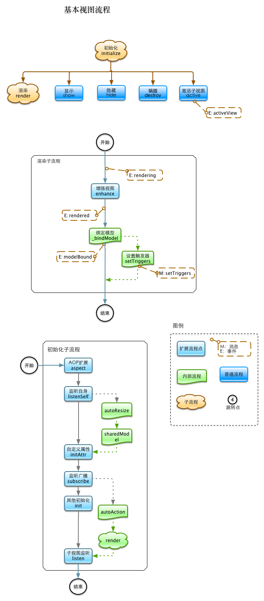
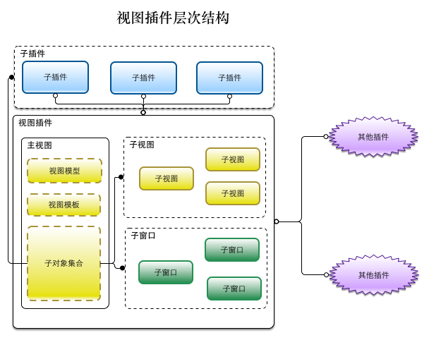

# BaseView

视图是 Veronica MVC 扩展的核心概念，相当于MVC框架中的控制器的概念，每一个界面部件就对应一个视图控制器

Veronica 使用 `Backbone` 库的 View 作为视图的基类，在此基础上，派生了一个公共的基类：baseView，默认通过`app.mvc.baseView`调用

大多数用户自定义的插件视图都通过`baseView`来进行扩展。

```js
var CustomView = app.mvc.baseView({/* 扩展的配置代码 */});
var view = new CustomView(options);
```

## 基本概念

### 基础视图的生命周期



### 基础视图的组成部分



### 向视图传递参数

每个视图都接收一堆参数作为配置，可通过`this.options.xxx`的方式访问，在自定义视图时，可设置默认的参数，通过设置 `defaults` 属性实，

在baseView中，预置了一堆配置参数，可访问API文档查阅

### 在视图中运用视图模型

每个视图都有一个视图模型对象，该对象是 KendoUI 中的 `ObservableObject` 实例（对该对象的详细了解请参照 KendoUI 的相关文档），

通过对视图模型数据的修改，实现界面的更新，是典型的`MVVM`模式

因此在实际编程中，**应尽量避免直接操作DOM**，而应该通过改变视图模型相关属性驱动界面的改变，界面数据的获取也直接通过视图模型获取

视图模型通过 `this.model()` 访问：

```js
var name = this.model().get('name');
```

每次 `render` 后，都会重新绑定视图模型

**设置视图模型**

调用 `this.model`，设置该视图的视图模型：

```js
this.model({
	name: 'jim',
	say: function(){

	}
});
```

每次设置视图模型后，会自动绑定视图模型，以使当前界面显示与视图模型一致，
如果不想设置时立刻绑定，则传入一个 `false` 的参数即可

```js
this.model({
	name: 'jim',
	say: function(){ }
}, false);
```

> **惯用法**
>
> 当模型设置发生在视图渲染之前时（渲染时会进行视图绑定），例如在 `initAttr` 和 `init` 方法中设置视图模型，
> 则必须设置自动绑定 `false`，否则会触发两次视图绑定

**绑定视图模型**

MVVM 的核心就是数据绑定，视图模型只有在绑定后，才会与界面元素建立双向更新机制

一般情况下，当界面重渲染和模型改变后，系统会自动重新绑定视图模型

你也可以通过调用内部方法 `_bindViewModel` 来手动绑定视图，一般情况下别这么做

KendoUI 的视图绑定会自动实例化 KendoUI 的控件，通过读取 `data-role` 及 `data-*` 等标签属性构建这些控件对象，这是一个很棒的特性，因此，有了视图模型绑定机制后，我们就可以尽量避免手动实例化相应的控件，标签配置的方式也使代码更加简洁

绑定视图模型完毕后会触发 `modelBound` 事件，这通常表明用户界面的呈现工作已经完成，我们可在模型绑定之后做一些后续操作，例如异步读取数据等

### 管理窗口

窗口就是一些弹出层，在许多UI控件库的实现中，Dialog 或 Window 等类型的控件 DOM 元素节点都放在根元素，不受视图根级元素的控制，当然排除这个因素，由于窗口的特殊性，我们也有必要对它进行单独管理

每个视图可开启任意多个对话框，对话框内可承载三类物件

1. 普通的HTML
2. 子视图
3. 子插件

当视图被销毁时，它所管理的对话框（子视图、子插件）也会被销毁（待确认）

同时，对于对于子视图和子插件类型的窗口，当窗口被关闭时，该窗口和相应地子视图、子插件
也会被销毁，如果再次打开，则是实例化的新窗口，这点要切记

**获取窗口**

调用 `this.window`

```js
var wnd = this.window('wndDefault');
```

**设置窗口**

与获取窗口调用方式一样，配置项：

```js
{
    name: '',  // 窗口的名称，例如：wndTemp
    type: 'normal',  // 窗口的类型，"noraml"、"widget"、"view",默认是 "normal"
    el: null,  // jquery 对象，作为窗口的宿主元素来源
    widgetOpt: null, // 可选项，当窗口类型为 ”widget“ 时, 使用插件的配置项
    viewOpt: null, // 可选项，当窗口类型为
    options: {  // 窗口的配置项（参见 kendo.window 的文档）
        appendTo: this.$el,
        animation: {
            open: false,
            close: false
        },
        resizable: false,
        draggable: false,
        modal: true
    }
}
```

### 管理子视图

一个 widget 仅有一个主视图，其余的视图都是它的子视图，同时，对于一些比较复杂的视图，也可以拆分成更细粒度的视图

当需要在视图中加入一个子视图时，使用方法：`this.view` 实现，例如：

```js
var subView = this.view('viewName', testView);
```

如果要获取某个子视图，则使用方法：

```js
var subView = this.view('viewName');
```

**声明子视图**

可在视图中配置声明它的子视图，这样在该视图渲染的过程中，会自动初始化这些子视图：

```js
views: {
  'subView1': function(){
     return new SubView({ sandbox: this.options.sandbox })
  },
  'subView2': ...
}
```

初始化一个子视图，通常会将该主视图的 `sandbox` 对象传递给子视图，这样在子视图中才能与其他插件进行通信

声明的子视图初始化是在主视图渲染中进行的，具体的过程是：当主视图进行渲染并生成根节点后，在未呈现到界面之前，会初始化并渲染子视图，因此，对于那些自动渲染的子视图来说，子视图的渲染、绑定发生在主视图绑定之前。

因此，由于大部分子视图宿主元素是位于主视图根元素的子节点上，因此对于已经绑定的子视图，当主视图绑定时，会发生重复绑定的现象。避免该问题的方案是，修改 KendoUI 的 binder 源代码，以实现选择性绑定的机制，这段代码如下：

```js
if(!$(childrenCopy[idx]).hasClass('k-bind-block'))
  bindElement(childrenCopy[idx], source, roles, parents);
```

这也是在现阶段没有办法的办法

**子视图的消息传递**

在主视图和子视图间通信，一般通过 `Backbone.Event` 相关 API 实现，一般的写法如下：

```js
listen: function(){
  this.listenTo(this.view('subView'), 'saved', function(){
    // 相应的处理代码
  });
  this.listenTo ....
}
```

关于事件的其他方法，可参见 Backbone 文档中的 Event 小节

出于设计方面的考虑，暂时不提供在子视图中监听主视图事件的方法

**延迟监听子视图**

在某些场景下，执行 `listen` 这个方法时，子视图还没有被实例化，或者子视图会被频繁的销毁和创建，以上两种情况可以使用 baseView 自带的方法：`listenToDelay`，该方法不管子视图是否存在，并且在子视图每次被创建时，都自动执行相应的事件监听函数，用法如下：

```js
this.listenToDelay('editView', 'saved', function (isLocal, state, data) {
    if (isLocal && state === 'add') {
        this.source().insert(0, data);
    }
    this.trigger('modified', isLocal);
});
```

与 `listenTo` 方法的唯一区别就是第一个传入参数不是子视图对象，而是子视图的名称

**共享视图模型**

在一些场景下，主视图会将它自己的视图模型传递给一个或多个子视图，这些子视图对该模型的更改会无缝的反映到主视图上，这种机制在一些复杂表单的场景中尤其有用。

这主要通过 `sharedModel` 和 `sharedModelProp` 两个配置属性实现， `sharedModel` 用于传递自身的视图模型给子视图，`sharedModelProp` 则是共享的字段，因为许多时候不必要传递整个对象给子视图，并且该属性可对模型的字段进行映射，如下：

```js
new SubView({
	sharedModel: this.model(),
	sharedModelProp: ['name', ['desc', 'description']]
})
// 最后传递给子视图的视图模型等价于：
// {
//    name: this.model().get('name'),
//    desc: this.model().get('description')
// }
```

### 扩展视图